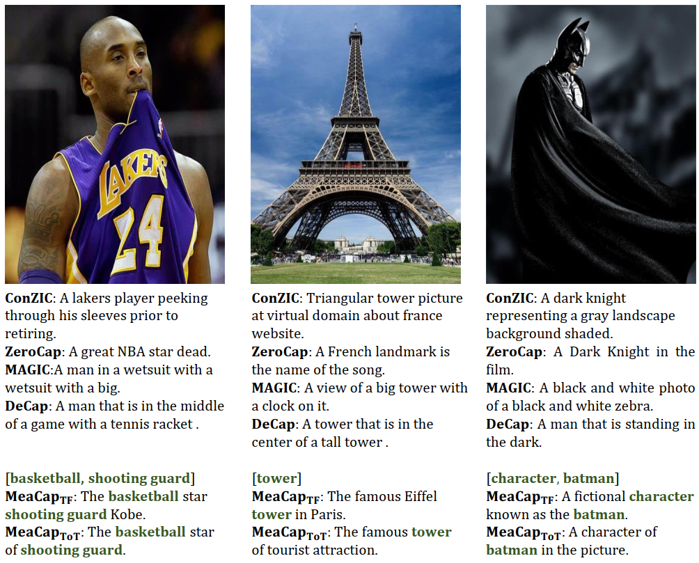
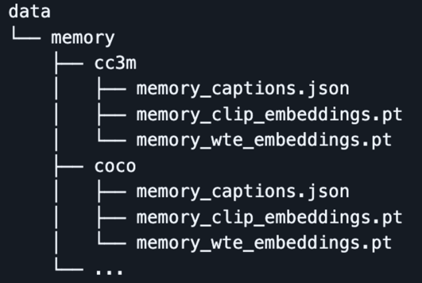
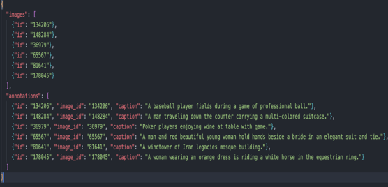

# [CVPR 2024] Improved MeaCap: Memory-Augmented Zero-shot Image Captioning

**Authors**:
[Vedant Sawant](linkedin.com/in/vedantsawant6900)
 
Improved implementation of  MeaCap.

 

 

# Steps to Replicate
## Step 1: 
### Clone the repository
## Step 2: 
### Setup Python Environment. Execute cells under setup environment
## Step 3: 
### Go into the environment/lib/python3.8/sentence_transformer/Sentence_Transformer.py and remove cache_download. Do the same with utils.py files in same folder
## Step 4:
### Download external memory for image captioning. 
### CC3M: [Link](https://huggingface.co/JoeyZoZ/MeaCap/tree/main/memory)
### SS1M: [Link](https://huggingface.co/JoeyZoZ/MeaCap/tree/main/memory)
### COCO: [Link](https://huggingface.co/JoeyZoZ/MeaCap/tree/main/memory)
### Flickr30k: [Link](https://huggingface.co/JoeyZoZ/MeaCap/tree/main/memory)
### After downloading put them in data folder
 
### you can also preprocess a new textual memory bank, for example:
### python prepare_embedding.py --memory_id coco --memory_path data/memory/coco/memory_captions.json
## Step 5: Download the openai/clip-vit-base-patch32 model which extracts the image content. [Click here to download.](https://huggingface.co/openai/clip-vit-base-patch32)
## Step 6: Download the SceneGraphParser lizhuang144/flan- t5-base-VG-factual-sg which helps us understand the objects and relationship. [Click here to download.](https://huggingface.co/lizhuang144/flan-t5-base-VG-factual-sg)
## Step 7: Download the SentenceBERT which helps in connecting different context into sentence. [Click here to download.](https://huggingface.co/sentence-transformers/all-MiniLM-L6-v2) 
## Step 8: Modify paths of all these downloaded files in get_args file.
## Step 9: Download Flickr30k Dataset with images and its annotations.
## Step 10: Split the dataset using karpathy split and put all images in ./image_example
## Step 11: Change annotation format as given in image.
## Step 12: As MeaCapTOT is the SOTA method use memory id as coco which is by default. Use Language model as CBART_COCO. 
## Step 13: Run python inference.py --memory_id coco --img_path ./image_example -- lm_model_path ./checkpoints/CBART_COCO
## Step 14: Check the output file in ./outputs and check the captions.
## Step 15: Finally Run the cocoeval.py to get the metrics and compare the Result.